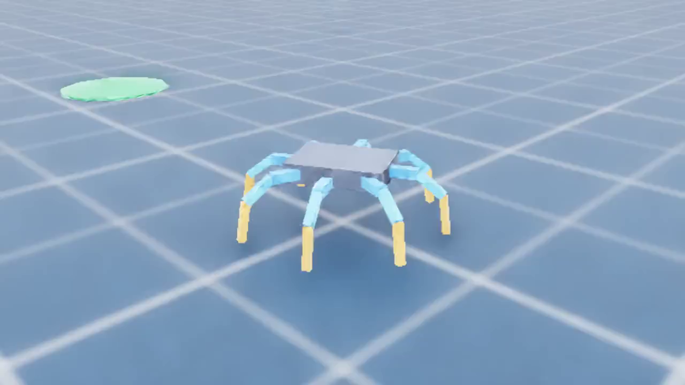

# DKSH-Sw-contest

Unity와 NVIDIA Isaac Lab에서 사용할 수 있는 8족 spiderbot 강화학습 프로젝트입니다.

분리 CAD 다리를 사용한 **8족·6족 조립 모델**과 Unity 프리팹도 제공합니다.
[모델 파일, 실행법 및 보정 가정](isaaclab_project/assets/spiderbot_variants/README.md)을 참고하세요.
Isaac Lab 실행 시 `-RobotModel cad8` 또는 `-RobotModel cad6`로 선택할 수 있습니다.



## 6족 자율 탐색 빠른 시작

Unity `LidarScene`에는 기존 Frontier 탐지·군집·목표 선택을 보존한 독립 실행 경로가 구성되어
있습니다. 최소 8방향 A*, 이진 clearance, line-of-sight waypoint 압축,
`CharacterController` 추종 및 단일 exploration coordinator를 사용합니다. ROS 브리지와
locomotion adapter는 독립 실행 동작을 방해하지 않도록 씬에서 기본 비활성 상태입니다.

ROS2 전환 경로는 `ros2` 폴더에 분리되어 있습니다. Docker Desktop을 시작한 뒤 다음처럼
Unity TCP Endpoint만 먼저 올립니다.

```powershell
.\ros2\manage.ps1 Start
.\ros2\manage.ps1 Validate
```

Unity Play Mode에서 `/clock`, `/scan`, `/odom`, `/tf`를 게시할 때만 headless
SLAM/Nav2 launch를 실행합니다. ROS 측은 Jazzy, SLAM Toolbox, SmacPlanner2D,
MPPI Omni, velocity smoother, collision monitor와 검증된 Frontier 후보 v1.6.1을 사용합니다.
현재 16 GB RAM·내장 Intel Arc PC에서는 Unity와 이 headless 스택만 함께 실행하고,
Isaac Lab 학습은 반드시 별도 세션에서 실행합니다. 상세 명령, 자원 상한 및 실측치는
[ROS2/Nav2 실행 안내](ros2/README.md)를 참고하세요.

## Isaac Lab 빠른 시작

현재 구성은 Isaac Sim 4.5.0과 호환되는 Isaac Lab 2.1.0/Python 3.10을 사용합니다. NVIDIA GPU와
Isaac Sim 4.5 standalone 설치가 필요하며, 기본 설치 위치가 다르면 경로를 지정합니다.

```powershell
git submodule update --init --recursive
.\setup_isaaclab.ps1
.\run_isaaclab.ps1 -Mode smoke
```

```powershell
.\setup_isaaclab.ps1 -IsaacSimPath "D:\path\to\isaac-sim-4.5"
```

설치 상태나 Isaac Sim 자체 동작을 별도로 확인하려면 빈 뷰어 또는 Isaac Lab 기본 Cartpole 학습을
실행할 수 있습니다.

```powershell
.\run_isaaclab.ps1 -Mode isaac-smoke
.\run_isaaclab.ps1 -Mode viewer
.\run_isaaclab.ps1 -Mode cartpole -NumEnvs 32
```

성공하면 `DKSH_ISAACLAB_SMOKE_PASS`가 출력됩니다. 실제 PPO 학습은 다음처럼 시작합니다.

```powershell
.\run_isaaclab.ps1 -Mode train -NumEnvs 32 -MaxIterations 1000
```

학습 결과는 `logs/rsl_rl/dksh_spider_navigation` 아래에 저장됩니다.

## 학습 환경 선택

`-Environment`로 평지(`flat`), 좁은 틈(`narrow`), 진동 바닥(`vibrating`),
낙하물 위험구역(`falling_debris`), 요철·단차(`rough`), 복합 환경(`mixed`)을 선택합니다.
`-Difficulty`는 0~1이며 기본값은 0.5입니다. `-Seed`로 무작위 시드를 지정할 수 있습니다.

```powershell
# 학습된 모델 없이 좁은 통로를 화면에서 확인
.\run_isaaclab.ps1 -Mode preview -Environment narrow -Difficulty 0.7 -NumEnvs 1

# 진동 바닥, 낙하물, 복합 환경 학습
.\run_isaaclab.ps1 -Mode train -Environment vibrating -NumEnvs 32 -MaxIterations 1000
.\run_isaaclab.ps1 -Mode train -Environment falling_debris -Difficulty 0.3 -NumEnvs 32
.\run_isaaclab.ps1 -Mode train -Environment mixed -Difficulty 0.5 -Seed 42 -NumEnvs 32

# 학습한 복합 환경 정책을 낙하물 구역에서 평가
.\run_isaaclab.ps1 -Mode evaluate -Environment falling_debris -NumEnvs 4 -Steps 1000
```

평지 이외의 환경은 장애물 관측이 32차원 추가되어 별도 `*_obstacles` 로그 폴더를 사용합니다.
같은 로봇 모델의 비평지 환경끼리는 정책을 공유할 수 있으며, 기존 평지 체크포인트는 호환되지 않습니다.
`preview`는 기본 자세로 환경을 확인하는 모드입니다. 학습한 보행을 보려면 `play`를 사용합니다.
환경별 동작과 실행 예시는 [학습 환경 안내](isaaclab_project/docs/training_environments.md)를 참고하세요.

가장 최근 체크포인트를 창 없이 유한 시간 검증하려면 다음 명령을 사용합니다.

```powershell
.\run_isaaclab.ps1 -Mode evaluate -NumEnvs 4 -Steps 500
```

특정 체크포인트를 지정할 때는 `-Checkpoint`를 함께 전달합니다. 화면에서 목표 지점과 동작을
재생하려면 다음 명령을 사용합니다(체크포인트 생략 시 가장 최근 모델 사용).

```powershell
.\run_isaaclab.ps1 -Mode play -NumEnvs 1
.\run_isaaclab.ps1 -Mode play -NumEnvs 1 -Checkpoint "C:\path\to\model.pt"
```

기본 로봇의 평지에서 로그가 없는 새 체크아웃은 함께 제공되는 `balance_baseline.pt`를 자동 사용합니다. 이 모델은
500회 PPO 학습으로 20초 자세 유지를 검증한 시작점이며, 목표 보행을 완성한 모델은 아닙니다.

등록된 환경 ID는 `Isaac-DKSH-Spider-Navigation-Direct-v0`입니다. 로봇은 실제 설계값을 반영한
8개 다리, 24개 MG996R 서보 articulation이며, 링크 길이(86.17/100/120 mm), 서보 토크
(0.980665 N·m), 질량과 관절 속도가 Isaac Lab 물리에 반영되어 있습니다.

Unity 프로젝트는 `DKSH SW Project`에 유지됩니다. Unity의 FBX는 외형 참고용이고, Isaac Lab은
안정적인 학습을 위해 동일 치수의 primitive URDF에서 변환한 로컬 USD를 사용합니다. URDF 생성
소스도 함께 보관되므로 치수와 질량을 바꾼 뒤 USD를 다시 만들 수 있습니다.

```powershell
.\rebuild_spiderbot_asset.ps1
```

Isaac Sim 4.5는 변환 파일을 정상 기록한 뒤 종료 코드 1을 반환할 수 있습니다. 재생성 스크립트는
필수 USD 4개가 실제로 생성됐는지 검사하며, 이 경우 경고를 표시하고 성공으로 처리합니다.

## 검증 범위

- 물리 주기 200 Hz, 정책 제어 주기 50 Hz
- 기본 8족 로봇: 평지 관측 84차원, 비평지 관측 116차원, 연속 행동 24차원
- CAD 6족 로봇: 평지 관측 66차원, 비평지 관측 98차원, 연속 행동 18차원
- 무작위 방향/거리 목표, 목표 도달·낙상·영역 이탈·시간 제한 종료
- PPO 보상 항목과 성공/낙상/시간초과를 TensorBoard 로그에 기록
- 초록색 원판으로 각 병렬 환경의 목표 반경 표시

URDF 구조만 빠르게 확인하는 테스트는 Isaac Sim을 시작하지 않아도 실행할 수 있습니다.

```powershell
python -m unittest discover -s .\isaaclab_project\tests -v
```

이 저장소 구성은 RTX 3070에서 32개 병렬 환경 × 500 스텝 스모크 테스트, PPO 500회
(384,000 samples), 체크포인트 32개 환경 × 1,000 스텝 평가를 통과했습니다. 포함된 기준 모델의
평가 결과는 낙상 0회, 시간 제한 종료 32회였습니다. 재생 경로에서는 MP4 렌더링과 JIT/ONNX
정책 내보내기도 확인했습니다.
