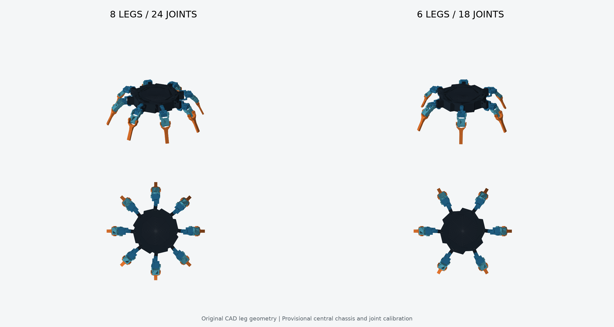

# CAD Spiderbot: 8족 / 6족

`DKSH SW Project/Assets/Prefabs/spiderbot/completeLEG.fbx`의 실제 다리 외형을
사용한 두 조립 모델입니다. 다리마다 3개의 회전 관절이 있으며, 조립 자세가 관절 0도입니다.

| 모델 | 관절 | 강체 | 관측 | 행동 |
|---|---:|---:|---:|---:|
| `spiderbot_8leg` | 24 | 25 | 84 | 24 |
| `spiderbot_6leg` | 18 | 19 | 66 | 18 |

각 디렉터리에 Isaac Lab용 `.usd` / `visuals.usdc`, 로봇 구조용 `.urdf` /
`meshes/*.obj`, 외형 확인용 `.glb`가 있습니다. **USD는 같은 폴더의
`visuals.usdc`와 함께 보관**해야 합니다. URDF는 `meshes` 폴더가 필요합니다.
GLB는 Z-up으로 저장되어 있으므로 뷰어에 따라 축 변환이 필요할 수 있습니다.

Unity 프리팹:

- `DKSH SW Project/Assets/Prefabs/spiderbot/Variants/Spiderbot8Leg/Spiderbot8Leg.prefab`
- `DKSH SW Project/Assets/Prefabs/spiderbot/Variants/Spiderbot6Leg/Spiderbot6Leg.prefab`

프리팹에는 관절 계층, ArticulationBody, 충돌 박스, 실제 CAD 메시와 URP 재질이
들어 있습니다. Unity는 Y-up, 미터 단위이며 루트 높이는 발이 바닥 위에 오도록 설정했습니다.
프리팹을 씬에 놓으면 사용할 수 있으며, 기존 탐색 프록시 컨트롤러와의 연결은 별도입니다.

## 모델링 기준과 제한

- 원본 `completeLEG.fbx`는 하나의 FBX 안에 **17개의 연결되지 않은 메시 조각**을
  포함합니다. 모든 조각을 한 번씩 사용해 장착부/hip/femur/tibia로 묶었습니다.
- 별도 부품 FBX는 조립 좌표를 갖고 있지 않아, 완성 다리의 조립 좌표를 기준으로
  사용했습니다. `assembly_manifest.json`에 부품별 대조 정보가 있습니다.
  `motorCover1End/2End`는 이 조립본과 동일한 표면적을 갖는 조각이 없어 임의로
  교체하지 않았습니다. 조립본에는 모터와 브래킷 형상도 포함되어 있습니다.
- 다리 메시의 형상을 늘리거나 단순화하지 않았습니다. CAD 원좌표를 mm로 가정해
  미터로 변환했습니다. FBX 자체의 확대 표시 배율은 사용하지 않았습니다.
- 다리 연결부 반지름은 120 mm, 새 중앙 원판은 반지름 85 mm / 두께 22 mm입니다.
  **중앙 원판은 이번에 만든 임시 몸체**이며 원본 하드웨어 설계가 아닙니다.
- 관절 중심은 원형 모터/베어링 형상에서 추정했습니다. hip 축은 수직,
  femur/tibia 축은 수평입니다. 제조용 CAD의 정확한 구속조건은 포함되어 있지 않습니다.
- 관절 간 거리는 조립본 기준 약 37 mm, 41 mm입니다. 기존 박스 로봇의
  86.17/100/120 mm 링크 모델과 치수와 영점이 다릅니다. 원본의 실제 단위를
  확인하기 전에는 실물과 일치한다고 해석하지 마세요.
- 질량은 기존 프로필에서 가져온 초기 추정치입니다(몸체 0.5 kg,
  다리당 0.30227 kg). 무게중심/관성은 박스 근사, 충돌체도 단순 박스입니다.
  USD/URDF의 토크 상한은 0.980665 N·m, 각도 제한은 ±90도이며 Isaac Lab 설정에서
  속도 상한과 PD 제어를 적용합니다. 자기충돌은 Isaac Lab에서 비활성화합니다.
- Unity 프리팹은 직접 직렬화했습니다. 이 PC의 Unity Editor 라이선스가
  활성화되지 않아 **Editor에서 임포트/Play 검증은 수행하지 못했습니다**.
  재저장용 C# 에디터 스크립트와 구조 검증 스크립트가 함께 제공됩니다.

## Isaac Lab 실행

저장소 루트에서:

```powershell
.\run_isaaclab.ps1 -Mode smoke -RobotModel cad8 -NumEnvs 1 -Steps 100
.\run_isaaclab.ps1 -Mode smoke -RobotModel cad6 -NumEnvs 1 -Steps 100

.\run_isaaclab.ps1 -Mode train -RobotModel cad8 -NumEnvs 32 -MaxIterations 1000
.\run_isaaclab.ps1 -Mode train -RobotModel cad6 -NumEnvs 32 -MaxIterations 1000
```

학습 로그는 각각 `logs/rsl_rl/dksh_spider_cad8_navigation`과
`logs/rsl_rl/dksh_spider_cad6_navigation`에 저장됩니다. 두 모델은 따로 학습합니다.
기존 `balance_baseline.pt`는 박스 로봇용이라 이 CAD 모델에 자동 적용하지 않습니다.
새 학습이 끝나면 같은 `-RobotModel`을 지정해 `play` 또는 `evaluate`합니다.

## 재생성

Python 3.12와 uv를 사용할 수 있는 환경에서:

```powershell
uv run --python 3.12 --with-requirements scripts/spiderbot-model-requirements.txt scripts/build_spiderbot_variants.py --unity
uv run --python 3.12 --with-requirements scripts/spiderbot-model-requirements.txt scripts/validate_spiderbot_variants.py
```

Unity가 활성화된 환경에서는 위 생성 후 에디터 메뉴
`DKSH > Spiderbot > Build 6 and 8 Leg Models`로 네이티브 재저장이 가능합니다.
생성기는 기존 GUID를 유지합니다. 원본 FBX가 바뀌면 잘못된 관절 배정을 막기 위해
생성을 중단하므로, 그때는 구성 조각과 관절 중심을 다시 맞춰야 합니다.

## 검증 기록

- 기존 primitive URDF 테스트 4개 통과.
- 두 버전의 URDF/USD/Unity 관절 수, 강체 수, 참조 경로, 메시 버퍼,
  관절 양쪽 좌표 일치와 Unity/USD 정점 일치를 검사했습니다.
- C# 재저장 스크립트는 설치된 Unity 6000.5.3f1 어셈블리에 대해 컴파일을 통과했습니다.
- Isaac Lab: 각 모델 1개 환경 × 100 제어 스텝, 유한 관측/보상/관절 상태,
  8족 24관절/25강체/84관측 및 6족 18관절/19강체/66관측 확인. 두 모델 모두 종료 0회.
- 학습 성공률이나 실물 전이는 검증 대상이 아니며, 장시간 학습은 실행하지 않았습니다.


